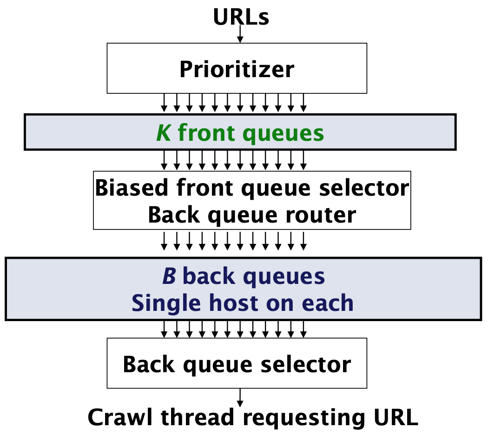

# Search-Engine-WI-Fall-19
This repository contains a web crawler and a search engine created in the information retrieval part of the web intelligence (Software, MSc.) course at AAU.

<h2>Web Crawling</h2>

**The principle of the web crawler**

The web crawler is a multi-threaded crawler built using the Mercator scheme used for the URL frontier, which means it implements frontqueues as well as back queues. The front queues manage prioritization and the back queues enforce politeness. Each backqueue is FIFO. A visual representation of the mercator scheme is seen on the figure below.

The general algorithm that the web crawler implements is given below.

1. Begin with initial set of URLs in queue/frontier – “the seed”
2. Fetch next page from URL in queue
3. Parse page
    1. Extract text and pass to indexer
    2. Check if URL has content already seen. If not:
        *  Add to index
        *  Extract “link-to” URLs and add to frontier queue
4. For each extracted URL
    1. Normalize URL
    2. Check that it passes certain URL filter tests. E.g.:
        * Focused crawl: only crawl .dk
        * Obey robots.txt (freshness caveat)
    3. Check that not already in frontier
    4. Add to frontier if passing tests
5. Delete or re-prioritize current URL from queue

The crawled urls are all saved to a file called urls.txt, such that the can be used for indexing and searching.

**Politeness**

In terms of politness of a web crawler we are concerned with explicit and implicit politeness.

* Explicit politeness: specifications from webmasters on what portions of site can be crawled (robots.txt)
* Implicit politeness: avoid hitting any site too often!

My webcrawler implements a simple robots.txt parser, which ensures that we do not crawl pages we are not authorised to. The robots.txt is fetched right before the page is retrived, and not when committing to the frontier. This ensures freshness meaning, that the robots.txt is up-to-date. In terms of implicit politeness, we ensure that only one connection is open to a host at any time. Also, we guarantee a few secs. waiting time between successive requests to a host

**PageRank**

The computation of pageranks is a preprocessing step that is query independent, therefore it is placed with the webcrawler. The PageRank algorithm outputs a probability distribution representing the likelihood that a person randomly clicking on links will arrive at any particular page. The intuition of the pagerank algorithm is thus to perform a random walk on the crawled web pages. This means, we start on a random page, and at each step continue to the next page along one of the links on the current page, equiprobably. This is run to convergence. The PageRank of a page is then the fraction of steps the surfer spends at the page in the limit. This score is between 0 and 1.  The rank (prestige) of a web-page is then proportional to:
* the proportion of random web-surfers that will be visiting the page at a given point in time
* the probability that a random web-surfer is at this page at any point in time

The implementation of pagerank is currently a little wonky, as it will return -infinite scores in some cases.

<h2>Search Engine</h2>

**Document Representation**

Before being able to index the pages that we previously crawled, we must decide on a way to represent the content of each page/document. This includes several preprocessing steps. These are all described in the following.

Firstly, we want all text reduced to a list of keyword, or a bag-or-words. This is a simplistic representation of a document, yet it is the most commen representation in information retrieval. We accomplish this by firstly *tokenising* the entire text of a document. A token is an instance of a sequence of characters from the input document that are grouped together as a useful semantic unit (e.g., separated by spaces, tabs, new-line, and other special characters).

With the resulting tokens we *remove stopwords*. The stopwords are taken from a list of the most common words in a given language. The intuition of excluding stopwords is that, the have little semantic content and may thus skew the quality of the search. Furthermore, a large proportion of text tend to be stopwords, thus removing them improves efficiency, both in terms of time and memory.

Next, we perform *stemming*. With stemming we reduce all words to their semantic stem. A given word may occur in a variety of syntactic forms, such as
plurals, past tense, or gerund forms. A stem is what is left after its affixes(prefixes and suffixes) are removed. When performing stemming the performance of the retrieval improves as
* Users rarely specify the exact forms of the word they are looking for
* Stemming reduces the size of the index
* Increases recall but harms precision
For this project Porter's Stemming Algorithm is the one of choice to perform stemming.

Lastly, all the remaining tokens are reduced to *lower case*. This is because we will not differentiate between upper and lower case letters.

**Indexing**

For indexing using the boolean retrieval model as well as the vector space model, the data structure used to represent the index is an inverted index. This means that, for each term, we store a list of all document ids that contain that term. This model can be extended and improved in several ways, but none I will touch upon here.

*Boolean Retrieval Model*

With the boolean retrieval model we want to be able to formulate a query as a boolean expression and find the documents that satisfies the condition. To compute this we construct the inverted index and use this look up the documents that contain the term that is searched for. Queries can be composed using AND, OR and NOT to perform more advanced queries. For example, with an AND query the intersection of the documents that satisfy the first part and the documents that satisfy the second part of the query would be those to return. This is thus a simple model based on set theory and boolean algebra, however it has certain pitfalls. Firstly, documents either match a query or they don't. It is often diccicult to define a query that will match a reasonsbale number or documents. Furthermore, most users are incapable of writing the boolean queries they need, and it may therefor be unusable. Though, for experts it may suit their needs. Instead, we look into content based ranking using the vector space model below.

*Vector Space Model*

With the vector space model all documents are modeled as vectors, where terms are the entries in the N dimensional vector space. These vectors are very high-dimensional and very sparse, as a document only contain a small subset of the entire vocabulary. Instead of each entry in the vector being merely a boolean 1 or 0 if the term is present in the document or not, we represent each term using the tf-idf weighting scheme. The tf-idf weighting scheme is a popular weighting scheme in information retrieval. Tf-idf is a value that describes a term in a collection of documents. The tf-idf value of a term increases with the number of occurrences within a document and with the rarity of the term in the collection. Therefore, a term occurring multiple times within a given document while occurring few times across all documents receives a high tf-idf score for that document. The tf-idf score of a term is computed based on the term frequency (tf) in that text and the inverted document frequency (idf), which is the inverse of the number of documents that contain the term. This means the tf is defined for the term per document and the idf is defined per term.

Having defined the documents as tf-idf vectors, we define a query as a tf-idf vectors as well. This allows us to use cosine similarity to find the documents that are closest to the query in vector space. We then rank based on the cosine score between the query and the given document.
